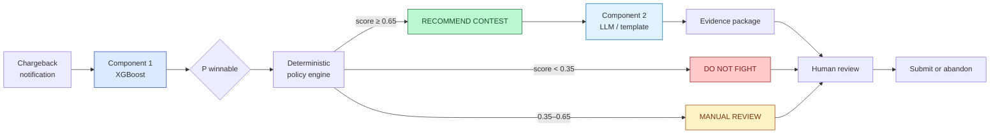
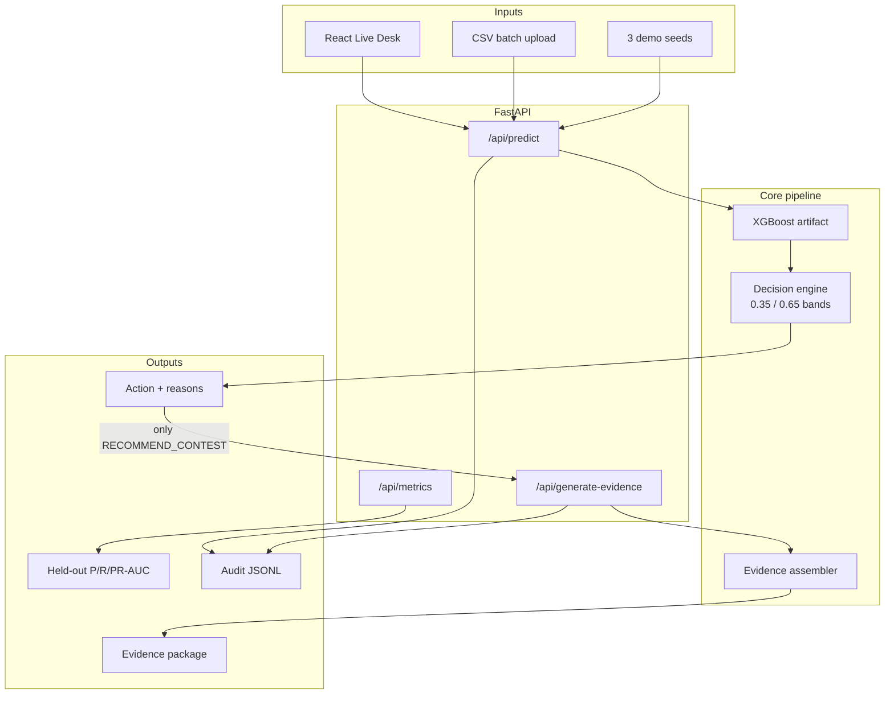
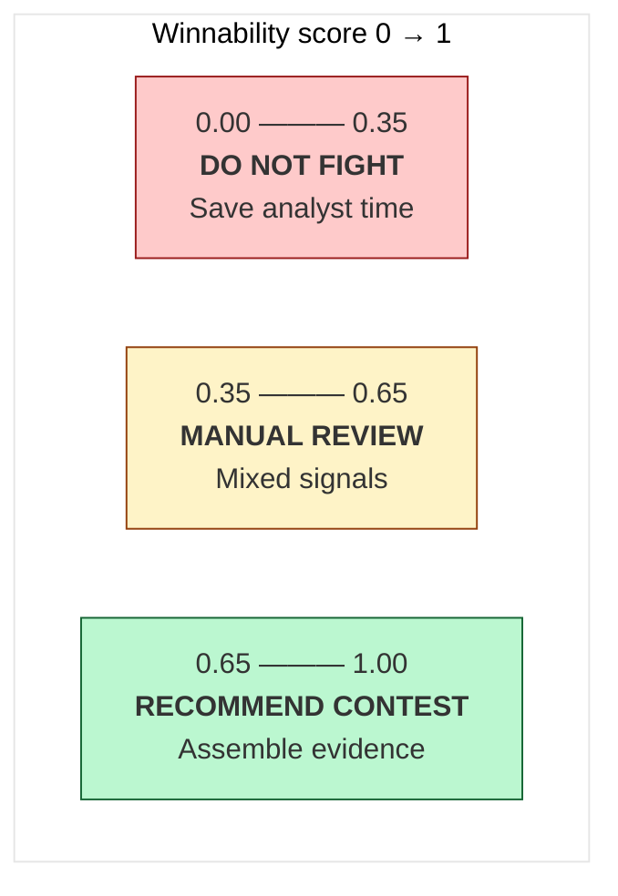
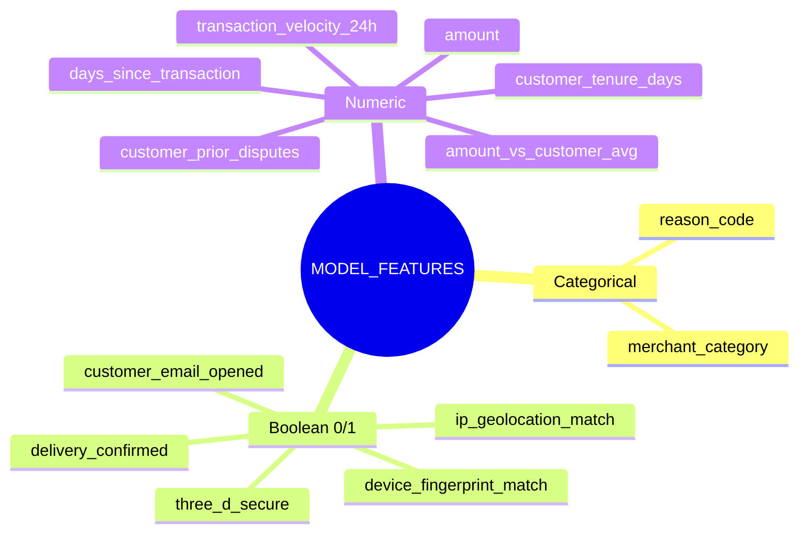
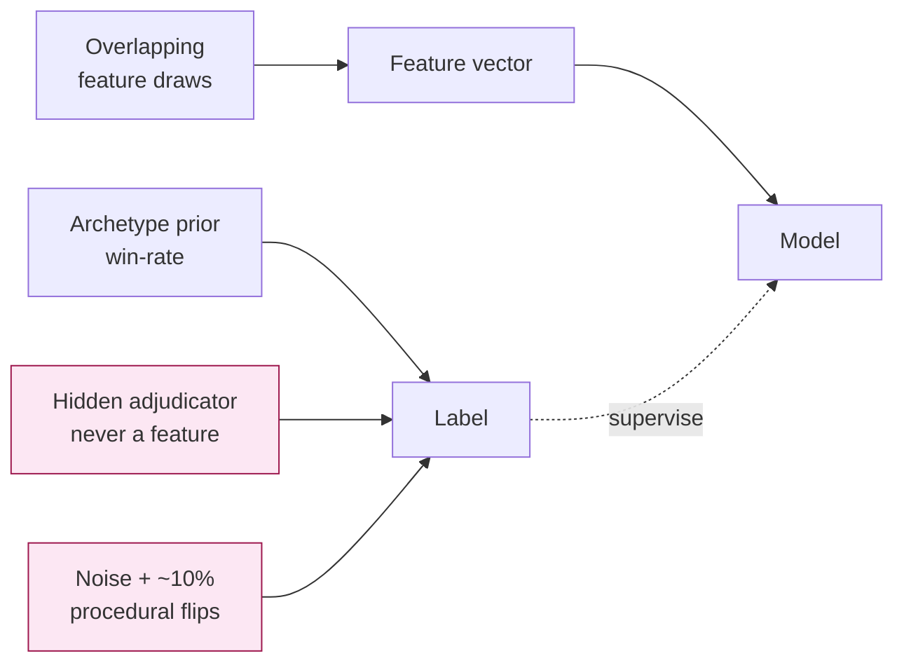

# Chargeback Sentinel

### AI Chargeback Representment System · Razorpay *AI Risk Manager*

<p align="center">
  <strong>Don't fight every chargeback. Fight the ones you can win.</strong>
</p>

<p align="center">
  
  
  
  
  <a href="https://razorpay-buildathon-knu4.onrender.com/"></a>
</p>

## Live demo (try it)

| | Link |
|---|---|
| **App (UI + API)** | **[https://razorpay-buildathon-knu4.onrender.com/](https://razorpay-buildathon-knu4.onrender.com/)** |
| Health check | [https://razorpay-buildathon-knu4.onrender.com/api/health](https://razorpay-buildathon-knu4.onrender.com/api/health) |
| API docs | [https://razorpay-buildathon-knu4.onrender.com/docs](https://razorpay-buildathon-knu4.onrender.com/docs) |

**Quick test path:** open the app → click demo cases **1 → 2 → 3** → open **Metrics**.

> Free Render instances may **sleep when idle**. First load can take ~30–60 seconds; refresh once if the page is slow.

> **Honest disclaimer:** The dataset is **synthetic**. It validates the *methodology* (features → score → policy → evidence). It does **not** claim production-level chargeback win rates.

---

## The problem in one glance

```text
 Today (typical desk)                         Chargeback Sentinel
 ┌─────────────────────────┐                  ┌─────────────────────────┐
 │ Fight almost everything │                  │ Score winnability first │
 │ Analyst time wasted     │      ───►        │ Route by policy bands   │
 │ Weak cases clog queues  │                  │ Evidence only if strong │
 │ Strong cases under-docs │                  │ Human still approves    │
 └─────────────────────────┘                  └─────────────────────────┘
```

**Loss class we defend:** *merchant loses money / time by contesting unwinnable disputes (or under-preparing winnable ones).*

---

## Solution approach (how it works)

Three layers. **Only the first two decide.** The LLM never sets the score.



### Who owns what

| Layer | Tool | Job | Sets the tier? |
|---|---|---|---|
| **Score** | XGBoost | `P(winnable \| features)` | Influences |
| **Policy** | Pure Python bands | Map score → action | **Yes** |
| **Evidence** | OpenAI *or* grounded template | Draft representment package | **No** |
| **Explain** | Feature gain signals | “Why this score” | No |
| **Gate** | Human analyst | Final submit / abandon | Final say |

---

## End-to-end system map



---

## Decision policy (visual)

Policy bands are **fixed and auditable** (separate from the binary cost-optimal threshold used only for metrics).



| Action | Meaning for the desk |
|---|---|
| `DO_NOT_FIGHT` | Low chance of winning — skip representment |
| `MANUAL_REVIEW` | Ambiguous — analyst inspects before spending time |
| `RECOMMEND_CONTEST` | Stronger case — generate grounded evidence draft |

Hard stop: duplicate chargebacks are never auto-contested.

---

## Model features (what the score actually uses)

Only these **13 fields** enter XGBoost. IDs, tracking text, and policy prose are **blocked from the score** (used later for evidence).



**Leakage blocklist (never in the model):** `won`, archetype name, hidden adjudicator, `tracking_id`, `delivery_timestamp`, `merchant_policy`, dates, IDs.

---

## Data strategy (why metrics are honest)

Labels are **not** a deterministic function of the visible features.



**Temporal split** (independent RNG seeds):

| Split | Calendar months | Role |
|---|---|---|
| Train | 1–8 | Fit model |
| Validation | 9–10 | Threshold / policy checks |
| **Held-out test** | 11–12 | Evaluated **once** after freeze |

---

## Held-out results (Component 1 — formal)

Temporal test set · n = 1000 · evaluated once after threshold freeze.

| Model | Precision | Recall | F1 | PR-AUC |
|---|---:|---:|---:|---:|
| Rules baseline | 0.55 | 0.37 | 0.45 | 0.47 |
| Logistic regression | 0.57 | 0.69 | 0.62 | 0.56 |
| Decision tree | 0.53 | 0.71 | 0.60 | 0.53 |
| **XGBoost (ours)** | **0.54** | **0.67** | **0.60** | **0.59** |

> Component 2 (LLM) is scored with **proxy** metrics only (schema validity, grounding / unsupported-claim rate). We **do not** claim precision/recall for the LLM.

Full dumps: [`evaluation/`](evaluation/) · decisions: [`docs/`](docs/)

---


## Repository map

```text
Razorpay-buildathon/
├── app/                 # FastAPI — predict, evidence, metrics, audit
├── ml/
│   ├── features/        # Canonical schema + leakage blocklist
│   ├── training/        # Baselines + XGBoost
│   └── artifacts/       # Frozen xgb.joblib + thresholds
├── data/
│   ├── synthetic/       # Archetypes + generator
│   └── splits/          # train / val / test CSVs
├── frontend/            # React + Vite live desk
├── evaluation/          # Held-out metrics JSON
├── docs/                # Architecture, data, FP cost, failures
├── tests/               # Unit tests
├── Dockerfile           # UI build + API in one image
└── README.md            # You are here
```

---

## Quick start

### Local (two terminals)

```bash
# 1) Backend
python -m venv .venv
# Windows: .venv\Scripts\activate
pip install -r requirements.txt
# First time only:
#   python -m data.synthetic.generator
#   python -m ml.training.train --final-test
uvicorn app.main:app --reload --port 8000

# 2) Frontend
cd frontend && npm install && npm run dev
```

- UI: http://127.0.0.1:5173  
- API docs: http://127.0.0.1:8000/docs  

Optional: copy `.env.example` → `.env` and set `OPENAI_API_KEY`.  
Without a key, evidence uses labelled **`template_fallback`** (demo still works).

### One URL (production-style)

```bash
cd frontend && npm run build && cd ..
uvicorn app.main:app --host 0.0.0.0 --port 8000
# → http://127.0.0.1:8000   (UI + /api together)
```

Or: `docker compose up --build` · cloud: Docker service + health `/api/health` (see `render.yaml`).

---

## Safety & scope

| Allowed | Not in scope |
|---|---|
| Defend merchant representment decisions | Offense / fraud-injection tooling |
| Score + route + draft evidence | Auto-submit without human review |
| Synthetic methodology evaluation | Claiming live scheme win rates |

Built for a student hackathon demonstration — **defense only**.
